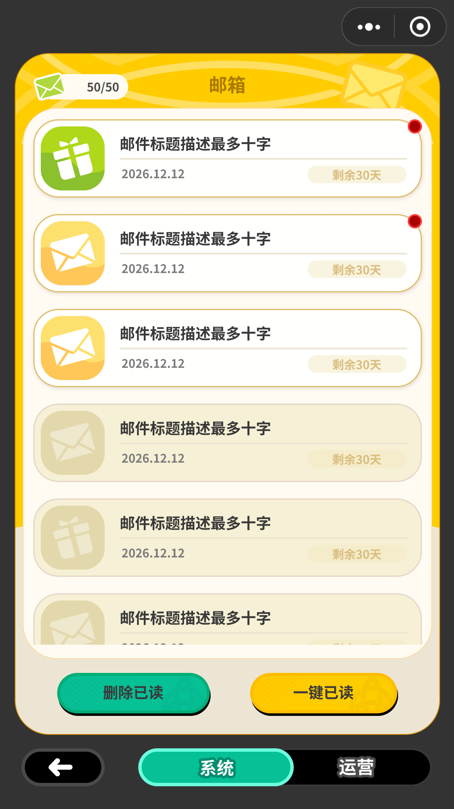

# FigKit — one Figma capture, five runnable outputs

[](https://github.com/ProdaZhang/figkit/actions/workflows/tests.yml)

*Turn a Figma frame into a runnable client — **HTML, Unity, Godot, Cocos Creator** — plus a semantic UI-DSL, all compiled from one pixel-faithful intermediate representation. Figma's own prototype links and transitions are imported; the **application semantics** on top (guards, data binding, app hooks) are declared once and run on every backend.*

```
figma REST ──► figma_capture ──►  IR: <screen>.ui.json (pixels) + flow.json (behavior)
                                   │        spec/ v1.1 — the shared contract, additive-only
        ┌──────────┬───────────┬───┴───────┬───────────┐
        ▼          ▼           ▼           ▼           ▼
   figma2html  figma2dsl  figma2unity figma2godot figma2cocos
   runnable    semantic   UXML+USS +  .tscn +     Creator TS
   HTML client UI-DSL(md) FlowBinder  GDScript    interpreter

        └──────────┴───────────┴──── figkit-motion ────┘
             the catalog all five share: 59 effects, 63 tokens, 6 algorithms
```

**What makes it different from figma-to-code exporters:** the **flow layer**. Figma's prototype interactions are real — FigKit imports them — but they run *inside the Figma player, against static frames*: prototype semantics. `flow.json` adds what a shipping client needs and Figma cannot express — guards over app state, list rows cloned from real data, and a clean engine-vs-app-hook boundary — keyed by Figma node ids so it survives re-capture. Every backend implements the *same* flow semantics, so one declaration runs everywhere.

## Status matrix (honest, per verification level)

| backend | offline tests | in-engine verification |
|---|---|---|
| figma2html | ✅ 89 | ✅ rendered + interactions, and the runtime's **behaviour** is now asserted in a real browser rather than looked at — 8 checks in [`tools/html-smoke/`](tools/html-smoke/), in CI on windows. It reads numbers out of the page (offsets, row texts, guard outcome, whether each string fits its box), not pixels |
| figma2dsl | ✅ 19 | ✅ (same render pipeline) |
| figma2godot | ✅ 30 | ✅ **Godot 4.3**, re-verified on **4.7.1**. Fed a real capture it found what synthesized fixtures cannot reach: Figma instance ids carry `;` while `sub_resource` ids accept only `[A-Za-z0-9_]`, so every StyleBoxFlat on an instanced element failed to register; and `clip_children` **cannot nest**, so a rounded panel inside a rounded panel lost its corners. Mail list vs HTML: **3.46/255**. Open gap: `radius: 50%` still draws as a capsule, not an ellipse. [full log](docs/verification.md#figma2godot--godot) |
| figma2unity | ✅ 24 | ✅ **Unity 6000.4.8f1** and **2022.3.62f3**, the latter as a real built Windows player rendering 1080×1920 — not just a batchmode import check. That run caught what an import check cannot: **one invalid USS selector voids the entire stylesheet**, so 129 rules applied to nothing and the screen was black. Later passes fixed per-axis radius clamping, Painter2D joining a path's contours into one polygon, and 3D texture-import defaults bleeding UI edges. `paths`, `clip` and outside borders are implemented rather than declared away; gradients are baked to PNG at compile time. Mail list vs HTML: **2.87/255**. Still lost: blurred shadows. [full log](docs/verification.md#figma2unity--unity) |
| figma2cocos | ✅ 16 | ✅ **Cocos Creator 3.8.8**, built for `web-desktop` and screenshotted at 1080×1920. Three of its bugs only an engine can show: nodes built in code land on the wrong layer, so the whole tree exists and **nothing draws, with no error**; `Graphics.arc` is not canvas's `arc` (its first point is a `moveTo`, and the sweep runs backwards); and `UIOpacity` does not affect `Graphics` at all. `clip` nests here via `GRAPHICS_STENCIL`, unlike Godot. Mail list vs HTML: **3.86/255**. Still lost: blurred shadows. [full log](docs/verification.md#figma2cocos--cocos-creator) |
| figkit-motion | ✅ 6 | 📖 **not a backend** — the motion catalog the other five share: 59 effects (when to use one, **and when not to**), 63 parameter tokens with a `calibration` status, 6 shared algorithms. No runtime, no artifact. Its `tokens.json` and `motion.py`'s `PRESET` are compared token-by-token by the conformance suite, so the prose and the values figkit actually writes can't drift apart |

Per-backend tests only compare a backend against its own expectations, so **31 more live in [`tools/conformance/`](tools/conformance/)**: one fixture exercising every IR feature, a table where each backend declares what it renders / approximates / drops, and checks that the declaration matches the real artifact, that every degradation is logged, and that it is written down in that backend's known-loss table. Three of those thirty are there because the suite itself had a hole: when the IR grew to v1.2 the new fields were added to the schema and to capture but **never to the fixture**, so they showed up as `paths: []` / `clip: false`, every backend "handled" them, every declaration "matched", and `paths` and `clip` were silently dropped by every backend with the whole suite green. It took feeding a real Figma file to a real engine to notice. Now: every field in the schema must be either declared structural or claimed by a feature; every declared feature's carrier element must hold a **non-default** value; and a backend that meets a field it does not implement has to name it on stderr. Same suite pins the backends to identical handling of malformed IR and of broken `flow.json` references, to the same sampled curve points, and — the layer that curve values alone can't reach — to the same *displacement basis*, the same shake waveform, and progress read off a clock rather than a tick count. (Counts above are verified by `tools/run_all_tests.py`, so they can't quietly go stale.)

## Try it (no Figma account, no install, ~10 seconds)

### ▶ [Open the live demo](https://prodazhang.github.io/figkit/)

Or clone and **double-click [`figma2html/examples/login/app.html`](figma2html/examples/login/app.html)** — no server, no build step: the demo's fixtures are inlined into `fixtures.js`, so it runs straight off `file://`. Either way, click through: notice modal, server list (row cloning), agreement guard, enter.


*(Recorded deterministically by [`tools/docs-assets/`](tools/docs-assets/) — each frame is a fresh page replayed to a given step, with the real animation objects paused at a given millisecond.)*

Prefer a server? `cd figma2html && python3 -m http.server 8321` → `http://localhost:8321/examples/login/app.html`.

### A real Figma file — and the half FigKit deliberately doesn't do

**[`figma2html/examples/mail/app.html`](figma2html/examples/mail/app.html)** — not synthesized. This one is captured out of a shipping game's Figma file: four screens, 129 elements on the list alone, three overlays, and all the things a hand-built fixture never thinks of — component-instance ids carrying semicolons, stroke geometry that arrives as a pre-cut band, an item frame rounded by an `isMask` sibling, a panel sweep whose `radius: 50%` is a genuine *ellipse* rather than a capsule. Every one of those broke a backend at least once; every one now has a measured entry in a `references/mapping.md`.


The close buttons are the smallest new thing here and the one that took a spec bump. Until **v1.1**, `events[].el` could only name nodes on the base screen, so the most common link in any real Figma file — the button *inside* a popup — had no representation; the workarounds meant "click anywhere" or "click outside", which is not the same thing. It is now `@in:<modal>:<nodeId>`.

The claim is the point of the GIF. Pressing it does not close one popup and open another — the same panel *swaps state in place*, into the claimed version with its watermark and its green delete button, on the `DISSOLVE` the flow declares. **FigKit implements none of that**, because it has no idea that two overlays are two states of one mail. It lives in [`examples/mail/app.js`](figma2html/examples/mail/app.js), in ten lines. That is the boundary this repo keeps: **the engine owns mechanics, you own meaning.**

The four screens are a real capture, so reproducing them needs the Figma file — but everything downstream of the IR runs from what is committed here. Compile the same screens for an engine:

```bash
python3 figma2godot/scripts/ui_to_tscn.py  figma2html/examples/mail/screen-list.ui.json out/ figma2html/examples/mail/flow.json
python3 figma2unity/scripts/ui_to_unity.py figma2html/examples/mail/screen-list.ui.json out/ figma2html/examples/mail/flow.json
```

(The third argument is optional; give it `flow.json` and the converter also bakes `motion.json` — the sampled transition curves.)

Same IR, four independent renderers. The question worth asking is not whether they agree with
each other — it is whether they agree with **the design**. So the baseline is the frame exported
from Figma at 1×, and every renderer is measured against it directly by
[`tools/design-diff/`](tools/design-diff/).

The error is split in two, because the halves mean different things. Figma, Chromium, Godot, Unity
and Cocos each rasterise glyphs their own way and always will; that difference is noise. Everything
else — geometry, colour, corners, strokes, images — is the actual claim.

**Mean difference from the Figma frame, outside text** (`/255`). The frames are committed in
[`examples/mail/design/`](figma2html/examples/mail/design), so this table is reproducible from a
clone:

| screen | HTML | Unity | Godot | Cocos |
|---|---|---|---|---|
| list | **0.81** | **1.01** | **1.21** | **1.34** |
| detail, with attachments | **0.53** | **0.59** | **0.64** | **0.57** |
| detail, nothing to claim | **0.59** | **0.62** | **0.70** | **0.63** |

```bash
python3 tools/design-diff/check.py figma2html/examples/mail/screen-list.ui.json \
                                   figma2html/examples/mail/design/screen-list.png
```

Every backend lands within **1.4/255** of the design once glyph rasterisation is set aside, and on
the two text-heavy screens the engines are within **0.1** of HTML. Text boxes cover 22% of the list
frame and account for 52% of its error.

Setting the text half aside is also what lets this comparison survive a translation. The design
frames are the Chinese originals; the demo ships in English, because a UI kit should be read by
people who don't read Chinese. A whole-frame number would therefore mostly measure the
translation — it runs 5–6/255 on these screens and would move again the next time anyone
relocalised a string, while the layout it is supposed to be judging stayed put. Comparing layout
rather than ink is exactly what a team does when it checks a localised build, and here it is
checkable rather than assumed: rebuilding all four backends from the pre-translation IR moves
eleven of these twelve cells by ≤0.02. The twelfth (Godot, middle screen) reads 0.81 in Chinese
against 0.64 in English, two thirds of it CJK ink spilling just outside the boxes the mask covers.

That last cell is the caveat stated in general: this only holds while the translated copy still
**fits the boxes the design captured**. When it doesn't, the overflow lands in the "outside text"
half and reads as a geometry error — English body copy wrapping one line past its box moved that
same cell from 0.53 to 0.82 with not one pixel of rendering changed. So it is asserted rather than
remembered: [`tools/html-smoke/`](tools/html-smoke/) measures every string in the demo against its
own box in a real browser, and fails on a line that doesn't fit.

Because the engines cannot be built on every push, a second, cheap comparison runs against the HTML
output instead — same IR, same scale, no Figma file needed. It answers a different question:
**whether the backends still understand the IR the same way.** If capture misreads the design, all
four move together and this table does not budge; if one backend regresses, only its row does.

| | vs HTML | pixels off by >24 |
|---|---|---|
| Unity 6000.4.8f1 | 2.87/255 | 3.0% |
| Godot 4.7.1 | 3.46/255 | 3.6% |
| Cocos Creator 3.8.8 | 3.86/255 | 4.5% |

All four share one subsetted design font. Before that, each backend fell back to its own system
font and even the line breaks disagreed, so the numbers measured little except glyph noise.

| Figma (the design) | HTML (Edge) | Unity | Godot | Cocos Creator |
|---|---|---|---|---|
|  |  |  |  |  |

The first column is the baseline the table above measures against — the Figma export itself, in the
design's own language. The other four are the same capture compiled four ways and translated.

And the login screen, which is synthesized rather than captured:

| HTML (Edge) | Godot 4.3 |
|---|---|
|  |  |

Every engine column is the *same* compiler output driven by the *same* `flow.json`.

The mail example's fourth screen is deliberately absent from the design comparison: its export is a
**later variant** of the frame — different item qualities, different counts, different tick artwork,
and a panel 9px higher — so it measures 4.22 and measures nothing about fidelity. That is the first
thing to suspect when this tool returns a bad number, and it is written down in its README rather
than quietly dropped.

## Real Figma input

1. Get a personal access token (scope `file_content:read` only). It is read by a single subprocess and never written to disk.
2. `GET /v1/files/<key>/nodes?ids=<frame>` → `nodes.json`
3. `python3 figma2html/scripts/figma_capture.py nodes.json <frameId> s01 <assetDir> assets out/screen-01`
4. **Import the prototype links you already drew in Figma** — `python3 figma2html/scripts/flow_from_figma.py nodes.json flow.json base=screen-01.ui.json notice=screen-02.ui.json` turns `interactions[]` (overlays, back/close, transitions) into a `flow.json` draft. Anything it *can't* carry is listed on stderr with the reason — it never guesses, because a wrong event looks exactly like a right one.
   Add `--motion-defaults` and it also writes in motion for the mechanics the engine owns — pressed states, modal enter **and exit**, list rows entering one after another, an element shaking when a guard rejects it. Most real Figma files have no prototype wiring at all, and a button that does nothing when pressed doesn't read as "undecorated", it reads as broken. Priority is always **Figma > your overrides > preset**, every added line carries `"source": "preset:base"` so you can see it, change it or delete it, and re-running adds nothing new. Those four are only the mechanics *figkit itself owns*; for everything else a real screen needs — dragging, rubber-banding, rewards flying into a bag, hitstop — [`figkit-motion/`](figkit-motion/) gives you the method and the parameters, and you implement it where it belongs.
5. Fill in the half Figma has no way to express — guards, list data-binding, app hooks (contract: [`spec/flow-events.md`](spec/flow-events.md)) — then check it with `python3 figma2html/scripts/flow_check.py flow.json`; a mistyped node id is otherwise only a console warning you'd hit by clicking. Now pick a backend.

Every step above is runnable with no Figma account: `examples/login/nodes.json` is a real-shaped REST response, and importing it reproduces the demo's `stage` / `caps` / `base` / `modals` exactly — the remaining `list`, `bindings` and guards are precisely the application semantics you write by hand.

## Install as Claude Code plugins

Each skill folder doubles as a [Claude Code](https://code.claude.com/docs) skill, and the repo is a plugin marketplace:

```shell
/plugin marketplace add ProdaZhang/figkit
/plugin install figma2godot@figkit      # or figma2html / figma2dsl / figma2unity / figma2cocos / figkit-motion
```

Prefer no plugin machinery? Just copy a folder into `.claude/skills/` — each one is self-contained. Per-skill usage lives in its `SKILL.md`.

> **Language note (honest version)**: English covers **this README, `CONTRIBUTING.md`, and the [`spec/`](spec/) IR contract** — the parts you need to understand or extend the format. Still **zh-CN**: the seven `SKILL.md` usage docs, every `references/mapping.md` (including the known-loss tables), and all of `figkit-motion/`. Always language-independent: all code, all tests, all JSON/field names, and the mapping tables' structure. The zh original of the spec is kept at `spec/*.zh.md` as a mirror, and `tools/spec_parity.py` compares the two so the schema can't drift apart. Translating one backend's `mapping.md` is now the highest-value PR — see [Translation in CONTRIBUTING](CONTRIBUTING.md#translation).

## Design principles

- **IR spec is frozen** ([`spec/`](spec/), v1.0): additive evolution only; backends never extend it privately.
- **Honest degradation**: what an engine can't render (blur, gradients, text-stroke…) is listed in that backend's `references/mapping.md` known-loss table and logged at generation/runtime — never dropped silently.
- **Curves are solved, never approximated by name.** Figma hands over a specific curve — `cubic-bezier(.32,.72,0,1)`, or a spring's `{mass, stiffness, damping}`. Every engine also ships easing *enums* that share those names and have different shapes (`Tween.EASE_OUT`, `Ease.OutQuad`, USS `ease-out`, `EEasingFunc`). Picking "the closest enum" per backend is how one IR becomes six different feels while every test stays green — the measured gap between `easeOutCubic` and `cubic-bezier(.23,1,.32,1)` is **19.8 percentage points**, right in the opening moments. So `motion.py` samples the real curve (Newton inversion for béziers, the analytic solution for springs) and the conformance suite compares the sampled points **backend against backend**. What Figma doesn't publish control points for (`BOUNCY`, `*_BACK`) stays `unresolved` rather than being guessed.
- **Deterministic converters** (stdlib-only, no timestamps) guarded by golden tests; capture has a byte-parity guard across its two copies.
- **Engine vs app-hook split**: engines own structure & mechanics (modals, guards, cloning); your code owns domain semantics via a small hook interface — identical shape in JS, C#, GDScript, C++ and TS.

## Scope (what it is not)

- It reproduces **UI screens and UI flow**, not gameplay. Real-time feel, networking and business logic stay downstream.
- Rotation of instance-internal nodes isn't provided by the Figma REST API (documented limitation; the escape hatch is an app-hook override).
- Vector clusters rasterize to PNG — the only unavoidable fidelity loss, independent of any backend.

## Lineage

FigKit grew out of [aigd](https://github.com/ProdaZhang/aigd) (中文 [aigd-zh](https://github.com/ProdaZhang/aigd-zh)) / [aidd](https://github.com/ProdaZhang/aidd) (AI-assisted design→dev methodology): `figma2dsl` feeds their UI-DSL knowledge layer, and the engine backends are the first concrete slice of their "implementation layer". Each project stands alone.

## License

[MIT](LICENSE) © 2026 ProdaZhang. Not affiliated with or endorsed by Figma, Inc.
