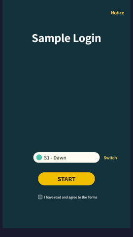
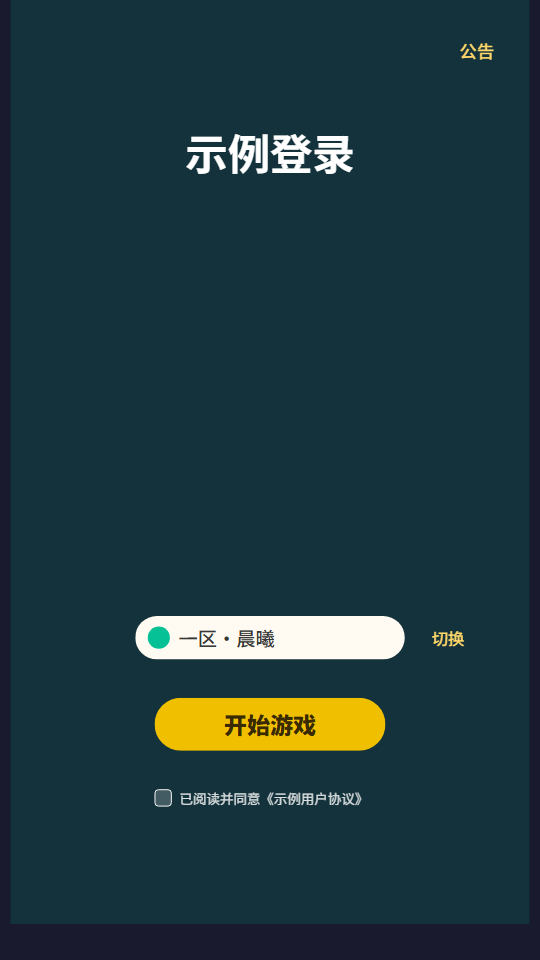
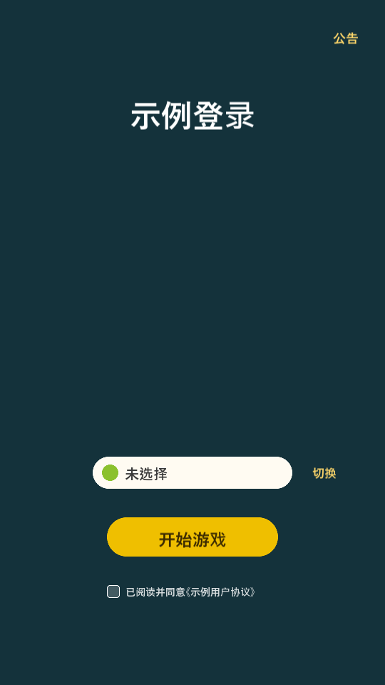

# FigKit — one Figma capture, six runnable outputs

[](https://github.com/ProdaZhang/figkit/actions/workflows/tests.yml)

*Turn a Figma frame into a runnable client — **HTML, Unity, Godot, Unreal, Cocos Creator** — plus a semantic UI-DSL, all compiled from one pixel-faithful intermediate representation with **declared interactions** (modals, guards, data binding) that Figma itself doesn't carry.*

```
figma REST ──► figma_capture ──►  IR: <screen>.ui.json (pixels) + flow.json (behavior)
                                   │        spec/ v1.0 FROZEN — the shared contract
        ┌──────────┬───────────┬───┴───────┬───────────┬───────────┐
        ▼          ▼           ▼           ▼           ▼           ▼
   figma2html  figma2dsl  figma2unity figma2godot figma2unreal figma2cocos
   runnable    semantic   UXML+USS +  .tscn +     uespec +     Creator TS
   HTML client UI-DSL(md) FlowBinder  GDScript    C++ widget   interpreter
```

**What makes it different from figma-to-code exporters:** the **flow layer**. Figma's prototype interactions are real — FigKit imports them — but they run *inside the Figma player, against static frames*: prototype semantics. `flow.json` adds what a shipping client needs and Figma cannot express — guards over app state, list rows cloned from real data, and a clean engine-vs-app-hook boundary — keyed by Figma node ids so it survives re-capture. Every backend implements the *same* flow semantics, so one declaration runs everywhere.

## Status matrix (honest, per verification level)

| backend | offline tests | in-engine verification |
|---|---|---|
| figma2html | ✅ 37 | ✅ rendered + interactions (Edge headless screenshot) |
| figma2dsl | ✅ 19 | ✅ (same render pipeline) |
| figma2godot | ✅ 20 | ✅ **Godot 4.3**: .tscn rendered, pixel-compared vs HTML; GDScript compiles clean |
| figma2unity | ✅ 11 | ✅ **Unity 6000.4.8f1**: C# compiles zero-warning, UXML/USS pass Unity's importer, CloneTree structure asserted (visual pass pending) |
| figma2unreal | ✅ 40 | ⏳ not yet compiled in UE. Two **engine-free gates** hold the line meanwhile: `uespec_contract.py` (python-emitted ↔ C++-read field parity, known-loss must be declared) and `uht_lint.py` (UE reflection conventions R1–R6: `.generated.h` last, `GENERATED_BODY`, `UINTERFACE` pairing, `Execute_` dispatch, GC visibility of UObject members, include→module registry). They check *conventions and contracts, not API truth* — whether `FSlateFontInfo` really has that field still needs a real compile. Risk self-assessment in `references/mapping.md` |
| figma2cocos | ✅ 11 | 🟡 TS strict-typechecks against official `@cocos/creator-types` (engine d.ts, decorators incl.); not yet run in Creator |

Per-backend tests only compare a backend against its own expectations, so **12 more live in [`tools/conformance/`](tools/conformance/)**: one fixture exercising every IR feature, a table where each backend declares what it renders / approximates / drops, and checks that the declaration matches the real artifact, that every degradation is logged, and that it is written down in that backend's known-loss table. Same suite pins the backends to identical handling of malformed IR and of broken `flow.json` references. (Counts above are verified by `tools/run_all_tests.py`, so they can't quietly go stale.)

## Try it (no Figma account, no install, ~10 seconds)

### ▶ [Open the live demo](https://prodazhang.github.io/figkit/)

Or clone and **double-click [`figma2html/examples/login/app.html`](figma2html/examples/login/app.html)** — no server, no build step: the demo's fixtures are inlined into `fixtures.js`, so it runs straight off `file://`. Either way, click through: notice modal, server list (row cloning), agreement guard, enter.



Prefer a server? `cd figma2html && python3 -m http.server 8321` → `http://localhost:8321/examples/login/app.html`.

All three screens are *synthesized* by [`make_fixture.py`](figma2html/examples/login/make_fixture.py) through the real capture pipeline — no Figma file, no token, no network. Then compile the same screens for an engine:

```bash
python3 figma2godot/scripts/ui_to_tscn.py  figma2html/examples/login/screen-login.ui.json  out/
python3 figma2unity/scripts/ui_to_unity.py figma2html/examples/login/screen-login.ui.json out/
```

Same IR geometry, two independent backends — rendered from the **zh** variant of the same fixture, which the test suites keep as the CJK coverage case:

| HTML (Edge) | Godot 4.3 |
|---|---|
|  |  |

## Real Figma input

1. Get a personal access token (scope `file_content:read` only). It is read by a single subprocess and never written to disk.
2. `GET /v1/files/<key>/nodes?ids=<frame>` → `nodes.json`
3. `python3 figma2html/scripts/figma_capture.py nodes.json <frameId> s01 <assetDir> assets out/screen-01`
4. **Import the prototype links you already drew in Figma** — `python3 figma2html/scripts/flow_from_figma.py nodes.json flow.json base=screen-01.ui.json notice=screen-02.ui.json` turns `interactions[]` (overlays, back/close, transitions) into a `flow.json` draft. Anything it *can't* carry is listed on stderr with the reason — it never guesses, because a wrong event looks exactly like a right one.
5. Fill in the half Figma has no way to express — guards, list data-binding, app hooks (contract: [`spec/flow-events.md`](spec/flow-events.md)) — then check it with `python3 figma2html/scripts/flow_check.py flow.json`; a mistyped node id is otherwise only a console warning you'd hit by clicking. Now pick a backend.

Every step above is runnable with no Figma account: `examples/login/nodes.json` is a real-shaped REST response, and importing it reproduces the demo's `stage` / `caps` / `base` / `modals` exactly — the remaining `list`, `bindings` and guards are precisely the application semantics you write by hand.

## Install as Claude Code plugins

Each `figma2*/` folder doubles as a [Claude Code](https://code.claude.com/docs) skill, and the repo is a plugin marketplace:

```shell
/plugin marketplace add ProdaZhang/figkit
/plugin install figma2godot@figkit      # or figma2html / figma2dsl / figma2unity / figma2unreal / figma2cocos
```

Prefer no plugin machinery? Just copy a folder into `.claude/skills/` — each one is self-contained. Per-skill usage lives in its `SKILL.md`.

> **Language note (honest version)**: English covers **this README, `CONTRIBUTING.md`, and the [`spec/`](spec/) IR contract** — the parts you need to understand or extend the format. Still **zh-CN**: the six `SKILL.md` usage docs and every `references/mapping.md` (including the known-loss tables). Always language-independent: all code, all tests, all JSON/field names, and the mapping tables' structure. The zh original of the spec is kept at `spec/*.zh.md` as a mirror, and `tools/spec_parity.py` compares the two so the schema can't drift apart. Translating one backend's `mapping.md` is now the highest-value PR — see [Translation in CONTRIBUTING](CONTRIBUTING.md#translation).

## Design principles

- **IR spec is frozen** ([`spec/`](spec/), v1.0): additive evolution only; backends never extend it privately.
- **Honest degradation**: what an engine can't render (blur, gradients, text-stroke…) is listed in that backend's `references/mapping.md` known-loss table and logged at generation/runtime — never dropped silently.
- **Deterministic converters** (stdlib-only, no timestamps) guarded by golden tests; capture has a byte-parity guard across its two copies.
- **Engine vs app-hook split**: engines own structure & mechanics (modals, guards, cloning); your code owns domain semantics via a small hook interface — identical shape in JS, C#, GDScript, C++ and TS.

## Scope (what it is not)

- It reproduces **UI screens and UI flow**, not gameplay. Real-time feel, networking and business logic stay downstream.
- Rotation of instance-internal nodes isn't provided by the Figma REST API (documented limitation; the escape hatch is an app-hook override).
- Vector clusters rasterize to PNG — the only unavoidable fidelity loss, independent of any backend.

## Lineage

FigKit grew out of [aigd](https://github.com/ProdaZhang/aigd) (中文 [aigd-zh](https://github.com/ProdaZhang/aigd-zh)) / [aidd](https://github.com/ProdaZhang/aidd) (AI-assisted design→dev methodology): `figma2dsl` feeds their UI-DSL knowledge layer, and the engine backends are the first concrete slice of their "implementation layer". Each project stands alone.

## License

[MIT](LICENSE) © 2026 ProdaZhang. Not affiliated with or endorsed by Figma, Inc.
