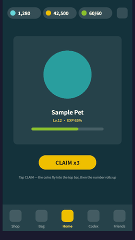
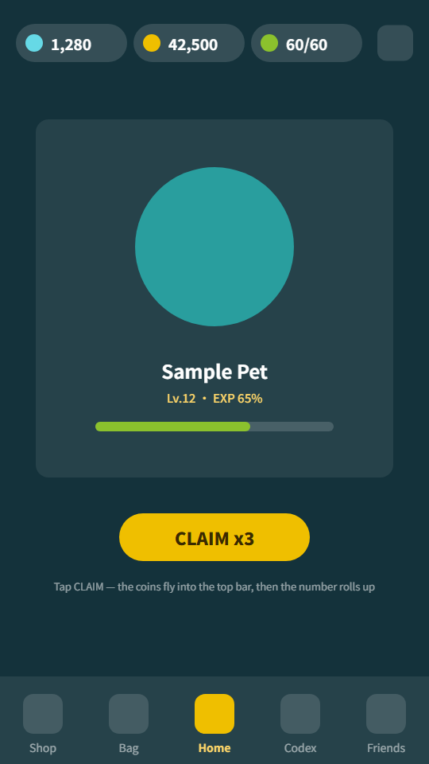

# FigKit — one Figma capture, six runnable outputs

[](https://github.com/ProdaZhang/figkit/actions/workflows/tests.yml)

*Turn a Figma frame into a runnable client — **HTML, Unity, Godot, Unreal, Cocos Creator** — plus a semantic UI-DSL, all compiled from one pixel-faithful intermediate representation. Figma's own prototype links and transitions are imported; the **application semantics** on top (guards, data binding, app hooks) are declared once and run on every backend.*

```
figma REST ──► figma_capture ──►  IR: <screen>.ui.json (pixels) + flow.json (behavior)
                                   │        spec/ v1.1 — the shared contract, additive-only
        ┌──────────┬───────────┬───┴───────┬───────────┬───────────┐
        ▼          ▼           ▼           ▼           ▼           ▼
   figma2html  figma2dsl  figma2unity figma2godot figma2unreal figma2cocos
   runnable    semantic   UXML+USS +  .tscn +     uespec +     Creator TS
   HTML client UI-DSL(md) FlowBinder  GDScript    C++ widget   interpreter

        └──────────┴───────────┴──── figkit-motion ────┴───────────┘
             the catalog all six share: 59 effects, 63 tokens, 6 algorithms
```

**What makes it different from figma-to-code exporters:** the **flow layer**. Figma's prototype interactions are real — FigKit imports them — but they run *inside the Figma player, against static frames*: prototype semantics. `flow.json` adds what a shipping client needs and Figma cannot express — guards over app state, list rows cloned from real data, and a clean engine-vs-app-hook boundary — keyed by Figma node ids so it survives re-capture. Every backend implements the *same* flow semantics, so one declaration runs everywhere.

## Status matrix (honest, per verification level)

| backend | offline tests | in-engine verification |
|---|---|---|
| figma2html | ✅ 71 | ✅ rendered + interactions, and the runtime's **behaviour** is now asserted in a real browser rather than looked at — 7 checks in [`tools/html-smoke/`](tools/html-smoke/), in CI on windows. It reads numbers out of the page (offsets, row texts, guard outcome), not pixels |
| figma2dsl | ✅ 19 | ✅ (same render pipeline) |
| figma2godot | ✅ 21 | ✅ **Godot 4.3**: both examples render; GDScript compiles clean. The login and main-screen shots below are a **real pixel comparison** against HTML — mean 2.2–3.9/255, under 2.5% of pixels off by more than 24, all of it on glyph edges (the two shots used to be at different scales, which looked fine and compared to nothing; `shoot_stage.py` fixes that). Motion runs in-engine and was **screenshotted mid-transition** — curves agree with Python and Unity to 6 decimals at a non-key point, and the frames caught a backdrop bug no numeric check could see. **The v1.1 `@in:` branch added on 2026-07-31 has not been through an engine run** — it is held by source-level conformance assertions only, and this row will stay qualified until someone re-runs the engine. |
| figma2unity | ✅ 13 | ✅ **Unity 6000.4.8f1**: C# compiles zero-warning; both examples' UXML/USS pass Unity's importer with CloneTree structure asserted (main screen: 37/29/13 elements, nesting and copy intact, 12-cell grid present); `motion.json` loads as `AnimationCurve`s agreeing with Python **and Godot** to 6 decimals (visual pass in Play Mode still pending). **Not re-run since 2026-07-31**, which changed `Play`/`Wiggle` to read `TimerState.now` and added the `@in:` branch; those lines are source-level only so far. |
| figma2unreal | ✅ 40 | ⏳ not yet compiled in UE. Two **engine-free gates** hold the line meanwhile: `uespec_contract.py` (python-emitted ↔ C++-read field parity, known-loss must be declared) and `uht_lint.py` (UE reflection conventions R1–R6: `.generated.h` last, `GENERATED_BODY`, `UINTERFACE` pairing, `Execute_` dispatch, GC visibility of UObject members, include→module registry). They check *conventions and contracts, not API truth* — whether `FSlateFontInfo` really has that field still needs a real compile. Risk self-assessment in `references/mapping.md` |
| figma2cocos | ✅ 14 | 🟡 TS strict-typechecks against official `@cocos/creator-types` 3.8.3 (engine d.ts, decorators incl.) — and **you can run that gate**: `cd tools/cocos-typecheck && npm ci && python3 check.py`, also in CI. It checks two things, because passing alone would not prove the second: zero errors, **and** that planting a certain type error into the real source makes `tsc` report it. Not yet run in Creator. Its motion is baked by its own `bake_motion.py`, and those sampled points are compared point-by-point against the other three backends |
| figkit-motion | ✅ 6 | 📖 **not a backend** — the motion catalog the other six share: 59 effects (when to use one, **and when not to**), 63 parameter tokens with a `calibration` status, 6 shared algorithms. No runtime, no artifact. Its `tokens.json` and `motion.py`'s `PRESET` are compared token-by-token by the conformance suite, so the prose and the values figkit actually writes can't drift apart |

Per-backend tests only compare a backend against its own expectations, so **26 more live in [`tools/conformance/`](tools/conformance/)**: one fixture exercising every IR feature, a table where each backend declares what it renders / approximates / drops, and checks that the declaration matches the real artifact, that every degradation is logged, and that it is written down in that backend's known-loss table. Same suite pins the backends to identical handling of malformed IR and of broken `flow.json` references, to the same sampled curve points, and — the layer that curve values alone can't reach — to the same *displacement basis*, the same shake waveform, and progress read off a clock rather than a tick count. (Counts above are verified by `tools/run_all_tests.py`, so they can't quietly go stale.)

## Try it (no Figma account, no install, ~10 seconds)

### ▶ [Open the live demo](https://prodazhang.github.io/figkit/)

Or clone and **double-click [`figma2html/examples/login/app.html`](figma2html/examples/login/app.html)** — no server, no build step: the demo's fixtures are inlined into `fixtures.js`, so it runs straight off `file://`. Either way, click through: notice modal, server list (row cloning), agreement guard, enter.


*(Recorded deterministically by [`tools/docs-assets/`](tools/docs-assets/) — each frame is a fresh page replayed to a given step, with the real animation objects paused at a given millisecond.)*

Prefer a server? `cd figma2html && python3 -m http.server 8321` → `http://localhost:8321/examples/login/app.html`.

### A second, bigger screen — and the half FigKit deliberately doesn't do

**[`figma2html/examples/main/app.html`](figma2html/examples/main/app.html)** — 75 elements over three screens: a currency bar, a pet card, a five-tab dock, an inventory grid, a codex list, two tabs a guard keeps locked, and a ✗ inside the bag.

That ✗ is the smallest new thing here and the one that took a spec bump. Until **v1.1**, `events[].el` could only name nodes on the base screen, so the most common link in any real Figma file — the close button *inside* a popup — had no representation; the workarounds meant "click anywhere" or "click outside", which is not the same thing. It is now `@in:<modal>:<nodeId>`, the ✗ in that GIF is a line the designer drew, and `flow_from_figma.py` imported it instead of reporting it as untranslatable.



The tail of that GIF is the point. Coins flying into the wallet, the number rolling up, the pill flashing — **FigKit implements none of it**, because it has no idea which element is the wallet. Those three live in [`examples/main/app.js`](figma2html/examples/main/app.js), and their method and parameters come from [`figkit-motion`](figkit-motion/): not one animation number is hardcoded, and a test checks that every token the hook reads actually exists in the catalog. That is the boundary this repo keeps: **the engine owns mechanics, you own meaning** — and the catalog is what stops "you own it" from meaning "you're on your own".

All three screens are *synthesized* by [`make_fixture.py`](figma2html/examples/login/make_fixture.py) through the real capture pipeline — no Figma file, no token, no network. Then compile the same screens for an engine:

```bash
python3 figma2godot/scripts/ui_to_tscn.py  figma2html/examples/main/screen-main.ui.json out/ figma2html/examples/main/flow.json
python3 figma2unity/scripts/ui_to_unity.py figma2html/examples/main/screen-main.ui.json out/ figma2html/examples/main/flow.json
```

(The third argument is optional; give it `flow.json` and the converter also bakes `motion.json` — the sampled transition curves, six of them for this screen.)

Same IR geometry, two independent backends. Both pairs below are shot at the **same scale** (`tools/docs-assets/shoot_stage.py`), so they are a real pixel comparison rather than two pictures that merely look alike: the login screen differs by a mean of 3.9/255 and the main screen by 2.2/255, essentially all of it on glyph edges — the geometry lands on the same pixels the IR's arithmetic predicts.

| | HTML (Edge) | Godot 4.3 |
|---|---|---|
| **login** (zh variant — the test suites' CJK coverage case) |  |  |
| **main** |  |  |

The two Godot columns are the *same* `flow_binder.gd` reading the *same* `flow.json`; what the engine cannot fill in — the codex rows, the grid tints — stays empty there, because that data comes from the app hook, which is per-project by design.

## Real Figma input

1. Get a personal access token (scope `file_content:read` only). It is read by a single subprocess and never written to disk.
2. `GET /v1/files/<key>/nodes?ids=<frame>` → `nodes.json`
3. `python3 figma2html/scripts/figma_capture.py nodes.json <frameId> s01 <assetDir> assets out/screen-01`
4. **Import the prototype links you already drew in Figma** — `python3 figma2html/scripts/flow_from_figma.py nodes.json flow.json base=screen-01.ui.json notice=screen-02.ui.json` turns `interactions[]` (overlays, back/close, transitions) into a `flow.json` draft. Anything it *can't* carry is listed on stderr with the reason — it never guesses, because a wrong event looks exactly like a right one.
   Add `--motion-defaults` and it also writes in motion for the mechanics the engine owns — pressed states, modal enter **and exit**, list rows entering one after another, an element shaking when a guard rejects it. Most real Figma files have no prototype wiring at all, and a button that does nothing when pressed doesn't read as "undecorated", it reads as broken. Priority is always **Figma > your overrides > preset**, every added line carries `"source": "preset:base"` so you can see it, change it or delete it, and re-running adds nothing new. Those four are only the mechanics *figkit itself owns*; for everything else a real screen needs — dragging, rubber-banding, rewards flying into a bag, hitstop — [`figkit-motion/`](figkit-motion/) gives you the method and the parameters, and you implement it where it belongs.
5. Fill in the half Figma has no way to express — guards, list data-binding, app hooks (contract: [`spec/flow-events.md`](spec/flow-events.md)) — then check it with `python3 figma2html/scripts/flow_check.py flow.json`; a mistyped node id is otherwise only a console warning you'd hit by clicking. Now pick a backend.

Every step above is runnable with no Figma account: `examples/login/nodes.json` is a real-shaped REST response, and importing it reproduces the demo's `stage` / `caps` / `base` / `modals` exactly — the remaining `list`, `bindings` and guards are precisely the application semantics you write by hand.

## Install as Claude Code plugins

Each skill folder doubles as a [Claude Code](https://code.claude.com/docs) skill, and the repo is a plugin marketplace:

```shell
/plugin marketplace add ProdaZhang/figkit
/plugin install figma2godot@figkit      # or figma2html / figma2dsl / figma2unity / figma2unreal / figma2cocos / figkit-motion
```

Prefer no plugin machinery? Just copy a folder into `.claude/skills/` — each one is self-contained. Per-skill usage lives in its `SKILL.md`.

> **Language note (honest version)**: English covers **this README, `CONTRIBUTING.md`, and the [`spec/`](spec/) IR contract** — the parts you need to understand or extend the format. Still **zh-CN**: the seven `SKILL.md` usage docs, every `references/mapping.md` (including the known-loss tables), and all of `figkit-motion/`. Always language-independent: all code, all tests, all JSON/field names, and the mapping tables' structure. The zh original of the spec is kept at `spec/*.zh.md` as a mirror, and `tools/spec_parity.py` compares the two so the schema can't drift apart. Translating one backend's `mapping.md` is now the highest-value PR — see [Translation in CONTRIBUTING](CONTRIBUTING.md#translation).

## Design principles

- **IR spec is frozen** ([`spec/`](spec/), v1.0): additive evolution only; backends never extend it privately.
- **Honest degradation**: what an engine can't render (blur, gradients, text-stroke…) is listed in that backend's `references/mapping.md` known-loss table and logged at generation/runtime — never dropped silently.
- **Curves are solved, never approximated by name.** Figma hands over a specific curve — `cubic-bezier(.32,.72,0,1)`, or a spring's `{mass, stiffness, damping}`. Every engine also ships easing *enums* that share those names and have different shapes (`Tween.EASE_OUT`, `Ease.OutQuad`, USS `ease-out`, `EEasingFunc`). Picking "the closest enum" per backend is how one IR becomes six different feels while every test stays green — the measured gap between `easeOutCubic` and `cubic-bezier(.23,1,.32,1)` is **19.8 percentage points**, right in the opening moments. So `motion.py` samples the real curve (Newton inversion for béziers, the analytic solution for springs) and the conformance suite compares the sampled points **backend against backend**. What Figma doesn't publish control points for (`BOUNCY`, `*_BACK`) stays `unresolved` rather than being guessed.
- **Deterministic converters** (stdlib-only, no timestamps) guarded by golden tests; capture has a byte-parity guard across its two copies.
- **Engine vs app-hook split**: engines own structure & mechanics (modals, guards, cloning); your code owns domain semantics via a small hook interface — identical shape in JS, C#, GDScript, C++ and TS.

## Scope (what it is not)

- It reproduces **UI screens and UI flow**, not gameplay. Real-time feel, networking and business logic stay downstream.
- Rotation of instance-internal nodes isn't provided by the Figma REST API (documented limitation; the escape hatch is an app-hook override).
- Vector clusters rasterize to PNG — the only unavoidable fidelity loss, independent of any backend.

## Lineage

FigKit grew out of [aigd](https://github.com/ProdaZhang/aigd) (中文 [aigd-zh](https://github.com/ProdaZhang/aigd-zh)) / [aidd](https://github.com/ProdaZhang/aidd) (AI-assisted design→dev methodology): `figma2dsl` feeds their UI-DSL knowledge layer, and the engine backends are the first concrete slice of their "implementation layer". Each project stands alone.

## License

[MIT](LICENSE) © 2026 ProdaZhang. Not affiliated with or endorsed by Figma, Inc.
