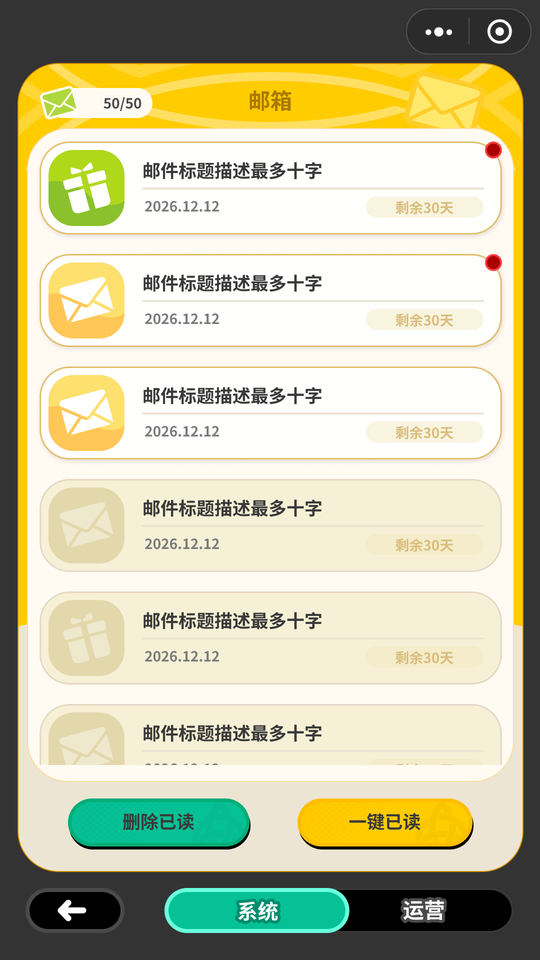
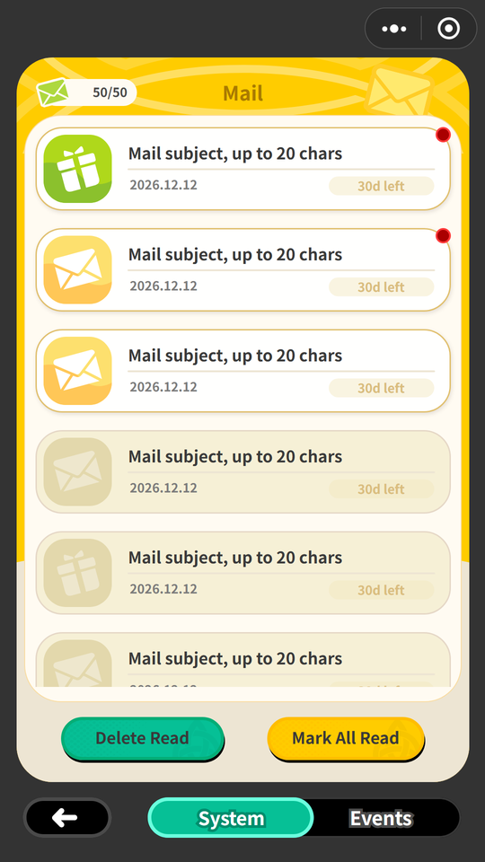
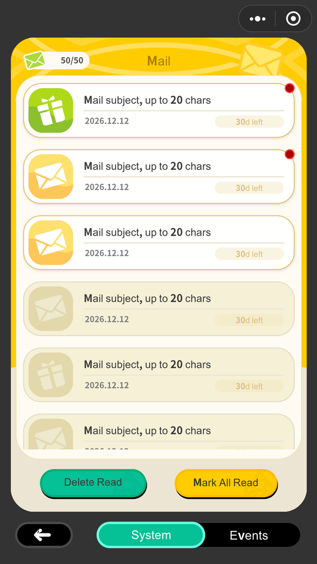
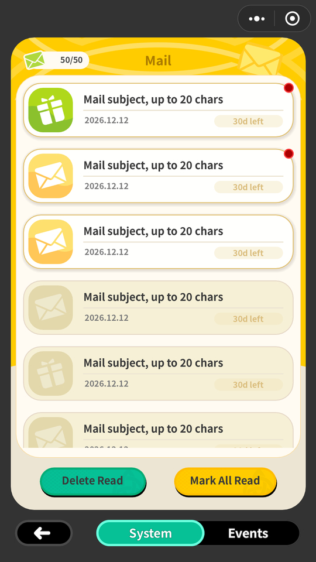
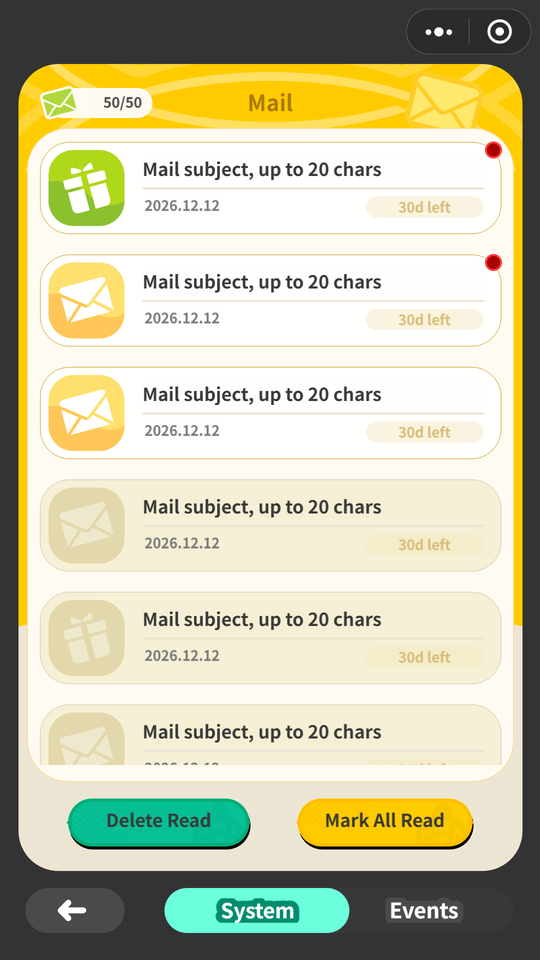
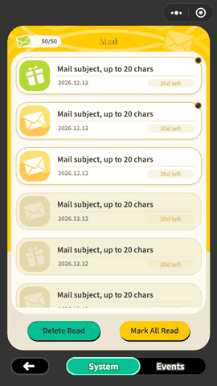

# FigKit — one Figma capture, five runnable outputs

[](https://github.com/ProdaZhang/figkit/actions/workflows/tests.yml)

*Turn a Figma frame into a runnable client — **HTML, Unity, Godot, Cocos Creator** — plus a semantic UI-DSL, all compiled from one pixel-faithful intermediate representation. Figma's own prototype links and transitions are imported; the **application semantics** on top (guards, data binding, app hooks) are declared once and run on every backend.*

| Figma (the design) | HTML (Edge) | Unity | Godot | Cocos Creator |
|---|---|---|---|---|
|  |  |  |  |  |

One frame out of a shipping game's Figma file, captured once and compiled four ways. Each backend is measured **against the first column** — the design — never against the others: four renderers can be identical and identically wrong.

**Mean difference from the Figma frame, outside text** (`/255`; [why outside text](#fidelity)):

| screen | HTML | Unity | Godot | Cocos |
|---|---|---|---|---|
| list | **0.81** | **0.81** | **1.13** | **1.13** |
| detail, with attachments | **0.53** | **0.59** | **0.65** | **0.57** |
| detail, nothing to claim | **0.59** | **0.62** | **0.63** | **0.63** |

The frames are committed in [`examples/mail/design/`](figma2html/examples/mail/design), so this reproduces from a clone:

```bash
python3 tools/design-diff/check.py figma2html/examples/mail/screen-list.ui.json \
                                   figma2html/examples/mail/design/screen-list.png
```

```
figma REST ──► figma_capture ──►  IR: <screen>.ui.json (pixels) + flow.json (behavior)
                                   │        spec/ v1.1 — the shared contract, additive-only
        ┌──────────┬───────────┬───┴───────┬───────────┐
        ▼          ▼           ▼           ▼           ▼
   figma2html  figma2dsl  figma2unity figma2godot figma2cocos
   runnable    semantic   UXML+USS +  .tscn +     Creator TS
   HTML client UI-DSL(md) FlowBinder  GDScript    interpreter

        └──────────┴───────────┴──── figkit-motion ────┘
             the catalog all five share: 59 effects, 63 tokens, 6 algorithms
```

**What separates it from a figma-to-code exporter: the flow layer.** Figma's prototype interactions are real and FigKit imports them, but they run *inside the Figma player, against static frames*. `flow.json` adds what a shipping client needs and Figma cannot express — guards over app state, list rows cloned from real data, a clean engine-vs-app-hook boundary — keyed by Figma node ids so it survives re-capture, and implemented identically by every backend.

## Status

| backend | offline tests | in-engine | vs design |
|---|---|---|---|
| figma2html | ✅ 94 | Edge, plus 8 behavioural checks in [`tools/html-smoke/`](tools/html-smoke/) that read numbers out of the live page — offsets, row texts, guard outcome, whether each string fits its box | **0.81** |
| figma2dsl | ✅ 19 | same render pipeline | — |
| figma2unity | ✅ 31 | **Unity 6000.4.8f1** and **2022.3.62f3**, the latter a real built Windows player at 1080×1920 | **0.81** |
| figma2godot | ✅ 34 | **Godot 4.3**, re-verified on **4.7.1** | **1.13** |
| figma2cocos | ✅ 19 | **Cocos Creator 3.8.8**, built for `web-desktop` and screenshotted at 1080×1920 | **1.13** |
| figkit-motion | ✅ 6 | 📖 not a backend — the motion catalog the other five share | — |

Per-backend tests only compare a backend against its own expectations, so **31 more live in [`tools/conformance/`](tools/conformance/)**: one fixture exercising every IR feature, a table where each backend declares what it renders / approximates / drops, and a check that the declaration matches the real artifact and that every degradation is logged. The same suite pins all backends to identical handling of malformed IR, broken `flow.json` refs, and sampled curve points. (`tools/run_all_tests.py` verifies the counts above, so they can't go stale.)

What each engine run actually found — every defect, in the order it surfaced — is in [`docs/verification.md`](docs/verification.md).

## Try it

**[▶ Open the live demo](https://prodazhang.github.io/figkit/)**, or double-click [`figma2html/examples/login/app.html`](figma2html/examples/login/app.html) — no server, no build step: the fixtures are inlined, so it runs straight off `file://`. Click through: notice modal, server list (row cloning), agreement guard, enter.


[**`examples/mail/app.html`**](figma2html/examples/mail/app.html) is the real one — the screens at the top of this page. Four of them, 129 elements on the list alone, three overlays, and everything a hand-built fixture never thinks of: component-instance ids carrying semicolons, stroke geometry arriving as a pre-cut band, an item frame rounded by an `isMask` sibling, a panel sweep whose `radius: 50%` is a genuine *ellipse*. Every one broke a backend at least once and now has a measured entry in a `references/mapping.md`.



Claiming the attachment does not close one popup and open another — the same panel *swaps state in place*, on the `DISSOLVE` the flow declares. **FigKit implements none of that**, because it has no idea two overlays are two states of one mail; it is ten lines in [`examples/mail/app.js`](figma2html/examples/mail/app.js). That is the boundary this repo keeps: **the engine owns mechanics, you own meaning.**

Re-capturing the screens needs the Figma file, but everything downstream of the IR runs from what is committed here:

```bash
python3 figma2godot/scripts/ui_to_tscn.py  figma2html/examples/mail/screen-list.ui.json out/ figma2html/examples/mail/flow.json
python3 figma2unity/scripts/ui_to_unity.py figma2html/examples/mail/screen-list.ui.json out/ figma2html/examples/mail/flow.json
```

## Fidelity

The error is split in two because the halves mean different things. Figma, Chromium, Godot, Unity and Cocos each rasterise glyphs their own way and always will; on these screens that noise dominates — whole-frame, the same renders read 5–6/255. Everything else — geometry, colour, corners, strokes, images — is the actual claim, and that is the table at the top of this page: every backend within **1.2/255**. One blended number would say the opposite.

Splitting it is also what lets the comparison survive a translation, since the design frames are Chinese and the demo is English: rebuilding all four backends from the pre-translation IR moves eleven of those twelve cells by ≤0.02. It holds on one condition — the translated copy must still **fit the boxes the design captured**. When it doesn't, the overflow lands in the non-text half and reads as a geometry error: English body copy wrapping one line past its box moved a cell from 0.53 to 0.82 with not a pixel of rendering changed. So it is asserted, not remembered — [`tools/html-smoke/`](tools/html-smoke/) measures every string against its own box in a real browser and fails on a line that doesn't fit.

Because engines can't be built on every push, a second, cheap comparison runs against the HTML output — same IR, no Figma file needed. It answers a different question: **whether the backends still understand the IR the same way.**

| | vs HTML, outside text | pixels off by >24 |
|---|---|---|
| Unity 6000.4.8f1 | 0.15/255 | 0.2% |
| Godot 4.7.1 | 0.50/255 | 0.5% |
| Cocos Creator 3.8.8 | 0.55/255 | 1.1% |

All four share one subsetted design font; before that each fell back to its own system font and even the line breaks disagreed, so the numbers measured little except glyph noise. The mail example's fourth screen is deliberately absent from the design comparison — its export is a **later variant** of the frame, so it measures 4.22 and measures nothing about fidelity.

## Real Figma input

1. A personal access token, scope `file_content:read` only. It is read by a single subprocess and never written to disk.
2. `GET /v1/files/<key>/nodes?ids=<frame>` → `nodes.json`
3. `python3 figma2html/scripts/figma_capture.py nodes.json <frameId> s01 <assetDir> assets out/screen-01`
4. **Import the prototype links you already drew in Figma** — `flow_from_figma.py nodes.json flow.json base=screen-01.ui.json notice=screen-02.ui.json` turns `interactions[]` into a `flow.json` draft, and lists anything it can't carry on stderr with the reason rather than guessing. `--motion-defaults` also writes in the mechanics the engine owns: pressed states, modal enter **and exit**, rows entering one after another, a shake when a guard rejects. Priority is **Figma > your overrides > preset**, every added line carries `"source"`, and re-running adds nothing new.
5. Fill in the half Figma cannot express — guards, list binding, app hooks ([`spec/flow-events.md`](spec/flow-events.md)) — then check it with `flow_check.py flow.json`; a mistyped node id is otherwise only a console warning you'd hit by clicking. Now pick a backend.

No Figma account needed to walk through it: `examples/login/nodes.json` is a real-shaped REST response, and importing it reproduces the demo's `stage` / `caps` / `base` / `modals` exactly.

## Install as agent skills

Each skill folder is self-contained — a `SKILL.md` plus the scripts it names, no build step and nothing beyond Python. Verified on **Claude Code, DeepSeek Harness, Codex and ZCode**.

**Install all six.** A session pays only for their frontmatter until one fires, and they are not interchangeable: `figma2unity`, `figma2godot` and `figma2cocos` carry no capture of their own and compile what `figma2html` produced. `figma2html` and `figma2dsl` each carry a capture and stand alone; `figkit-motion` needs nothing.

**Claude Code** — the repo doubles as a plugin marketplace, or copy the folders in:

```shell
/plugin marketplace add ProdaZhang/figkit
/plugin install figma2html@figkit    # and figma2dsl, figma2unity, figma2godot, figma2cocos, figkit-motion
cp -r figma2* figkit-motion ~/.claude/skills/        # ...or no plugin machinery at all
```

**DeepSeek Harness** — `cp -r figma2* figkit-motion ~/.dsh/skills/`, or into `<projectRoot>/.dsh/skills/`, which outranks the user root. No restart: the local provider watches both roots and attaches to one created while it runs. Invoke `/figma2html`; DSH injects the body with a `Base directory for this skill: <path>` hint, which is what makes each `SKILL.md`'s relative script paths resolve. Verified on `0.1.0-rc.8`.

**Codex** — `git clone https://github.com/ProdaZhang/figkit ~/.codex/skills/figkit`. Codex walks that root recursively, so one directory delivers all six under their plain names. **Do not use `codex plugin add`**: it reports success and lists the plugin `installed, enabled`, and the skill still never appears in a session — its plugin loader wants `<plugin>/skills/<name>/SKILL.md`, while a FigKit plugin carries `SKILL.md` at the root, the layout Claude Code accepts. A silent no-op is worse than a refusal. Verified on `codex-cli 0.147.0-alpha.6.5` and `0.148.0-alpha.15`. Two caveats, both Codex's own: its sandbox runs as a low-privilege account that cannot read a Python installed under your user profile and quietly falls back to whatever it can reach, so hand it an explicit interpreter path or watch the suite die on `math.dist`; and `test_bundle_is_fresh` rewrites a fixture in place, which a read-only sandbox denies — grant write access for that run, and the test restores the file itself.

**ZCode** — `cp -r figma2* figkit-motion ~/.zcode/skills/`. `zcode skills list` prints what it found, which is the quickest way to confirm an install; skills are scanned at startup, so restart a client that was already running. Verified on desktop `3.8.1` (bundled CLI `0.16.3`).

DeepSeek Harness and ZCode read exactly one level — `<name>/SKILL.md` — which is why only Codex can take the repo whole.

Per-skill usage lives in its `SKILL.md`. [`tools/`](tools/) sits at the repo root, outside every skill folder, so a skill-only install does not get it — clone when you want to measure fidelity rather than just produce it. Every `SKILL.md` spells the interpreter `python3`, which Windows usually lacks; use `python` there.

## Design principles

- **IR spec is frozen** ([`spec/`](spec/)): additive evolution only; backends never extend it privately.
- **Honest degradation**: what an engine can't render is listed in that backend's `references/mapping.md` known-loss table and logged at generation or runtime — never dropped silently.
- **Curves are solved, never approximated by name.** Every engine ships easing *enums* sharing Figma's names with different shapes; the measured gap between `easeOutCubic` and `cubic-bezier(.23,1,.32,1)` is **19.8 percentage points**, right in the opening moments. So `motion.py` samples the real curve — Newton inversion for béziers, the analytic solution for springs — and what Figma publishes no control points for stays `unresolved` rather than guessed.
- **Deterministic converters**, stdlib-only and guarded by golden tests; capture has a byte-parity guard across its two copies.
- **Engine vs app-hook split**: engines own structure and mechanics, your code owns domain semantics through one small hook interface — identical shape in JS, C#, GDScript and TS.

## Scope (what it is not)

- It reproduces **UI screens and UI flow**, not gameplay. Real-time feel, networking and business logic stay downstream.
- Rotation of instance-internal nodes isn't provided by the Figma REST API; the escape hatch is an app-hook override.
- Vector clusters rasterize to PNG — the only unavoidable fidelity loss, independent of any backend.

## Language

English covers this README, `CONTRIBUTING.md` and the [`spec/`](spec/) IR contract — the parts you need to understand or extend the format. Still zh-CN: the six `SKILL.md` docs, every `references/mapping.md` including the known-loss tables, and all of `figkit-motion/`. Code, tests and field names are language-independent, and `tools/spec_parity.py` keeps `spec/*.md` and `spec/*.zh.md` from drifting apart. Translating one backend's `mapping.md` is the highest-value PR — see [Translation in CONTRIBUTING](CONTRIBUTING.md#translation).

## Lineage

FigKit grew out of [aigd](https://github.com/ProdaZhang/aigd) (中文 [aigd-zh](https://github.com/ProdaZhang/aigd-zh)) / [aidd](https://github.com/ProdaZhang/aidd), an AI-assisted design→dev methodology: `figma2dsl` feeds their UI-DSL knowledge layer, and the engine backends are the first concrete slice of their implementation layer. Each project stands alone.

## License

[MIT](LICENSE) © 2026 ProdaZhang. Not affiliated with or endorsed by Figma, Inc.
